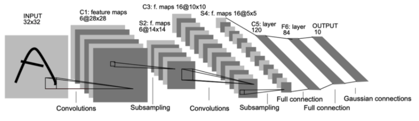

# SURVIVAL from the Adversarial Attack: Data Augmentation & Deep Layers

 There is an algorithm called Adversarial Attack(hereafter A.A.). It can generate data which is easily distinguishable from a human eye but not from deep learning models. In this project, we implement A.A. algorithm and measure effects for the image classification models. Moreover, we also measure the defensive performance of data augmentation(hereafter D.A.) methods and of more deeply designed models against A.A. Our experiments show that the most efficient defensive methods among D.A.s is Random Rotation. It is also confirmed that the deeper the layer of the model, the higher the defensive capability against A.A.

---
# Defensive Performance by Data Augmentation Methods

## Model

The used models are designed based on LeNet-5. Because it is one of the most basic image classification model.



## Usage

1. Make the weights of the Base Model and the Augmented Model
    - `{model_name}_{dataset}.ipynb`
    ex) Base model, MNIST → BaseModel_MNIST.ipynb
    - Augmented Model makes each data augmented weights at once.
    
    ### Result
    
    `{dataset}_weights_{BaseModel or DataAugmentingMethod}.ipynb`
    ex) MNIST, Base model → mnist_weights_BaseModel.pth
    
2. Input one weight in turn and Attack the models
    - You have to run the file that matches the used dataset.
    - You can attack each model by changing the ‘.pth’ file name of the following line
    
    ```python
    model.load_state_dict(torch.load('cifar10_weights_GaussianBlur.pth'))
    ```

---
# Defensive Performance by Deep Layers


## Model

In  `src/model.py`

- Net -> 5Net
- BNet -> 7Net
- MNet -> 8Net

## **Adversarial Attack Implement**

In `src/aa.py`

## Datasets

Downloading when first excutation In data/{dataset_name}

## **Results**
### **Model Performance**
 
`{test_dataset_name}_{model}.ipynb`
    
ex) MNIST dataset, 5Net model → MNIST_5Net.ipynb

### **Model Performanace with Adversarial Attack**
`{test_dataset_name}_{model}_aa.ipynb`

  ex) MNIST dataset, 5Net model → MNIST_5Net_aa.ipynb
